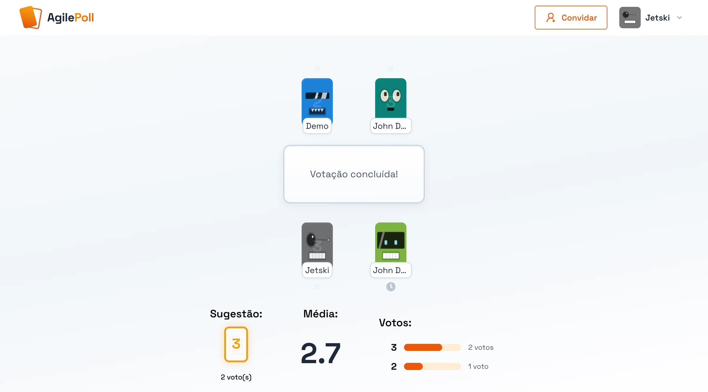

<p align="center">
  
</p>

<h1 align="center">AgilePoll</h1>

<p align="center">
  Ferramenta de Planning Poker para equipes ágeis.<br/>
  Crie uma sala, compartilhe o código e vote em tempo real — sem cadastro.
</p>

<p align="center">
  <a href="https://agilepoll.rhtua.com.br">
    
  </a>
</p>

<p align="center">
  
  
  
  
  
</p>

---

<p align="center">
  
</p>

---

## Funcionalidades

- **Tempo real** — votos sincronizados via Firebase Realtime Database
- **Sem cadastro** — autenticação anônima, basta informar o nome
- **Múltiplos sistemas de pontuação** — Fibonacci, Camiseta (XS–XXL), Padrão ou customizado
- **Controle de visibilidade** — o dono da sala decide quando revelar os votos
- **Reset de rodada** — limpa os votos para a próxima estimativa
- **Transferência de ownership** — o dono pode passar o controle para outro participante
- **Convite por link ou código** — facilita a entrada na sala

---

## Stack

| | Tecnologia |
|---|---|
| Framework | [Next.js 15](https://nextjs.org/) · App Router |
| UI | [Chakra UI v3](https://chakra-ui.com/) · [React Icons](https://react-icons.github.io/react-icons/) |
| Backend | [Firebase Realtime Database](https://firebase.google.com/docs/database) |
| Auth | [Firebase Auth](https://firebase.google.com/docs/auth) · anônima |
| Lint | [Biome](https://biomejs.dev/) |
| Observabilidade | [Vercel Speed Insights](https://vercel.com/docs/speed-insights) |

---

## Rodando localmente

**Pré-requisitos:** Node `^22`, npm `^10`/`^11` e um projeto no [Firebase Console](https://console.firebase.google.com/) com Realtime Database + Auth anônima habilitados.

```bash
git clone https://github.com/rhtua/agilePoll.git
cd agilePoll
npm install
npm run dev   # localhost:3000
```

### Variáveis de ambiente

Crie um arquivo `.env.local` na raiz do projeto com as variáveis abaixo. Os valores estão em **Firebase Console → Configurações do projeto → Seus aplicativos**:

```env
NEXT_PUBLIC_FIREBASE_API_KEY=
NEXT_PUBLIC_FIREBASE_AUTH_DOMAIN=
NEXT_PUBLIC_FIREBASE_DB_URL=
NEXT_PUBLIC_FIREBASE_PROJECT_ID=
NEXT_PUBLIC_FIREBASE_STORAGE_BUCKET=
NEXT_PUBLIC_FIREBASE_MESSAGING_SENDER_ID=
NEXT_PUBLIC_FIREBASE_APP_ID=
NEXT_PUBLIC_FIREBASE_MEASUREMENT_ID=
```

---

## Scripts

| Comando | Descrição |
|---|---|
| `npm run dev` | Servidor de desenvolvimento |
| `npm run build` | Build de produção |
| `npm run start` | Servidor em modo produção |
| `npm run lint` | Linter (Biome) |
| `npm run cleanup` | Remove salas antigas do banco de dados |

> O script `cleanup` usa o Firebase Admin SDK para deletar salas com mais de N dias. Requer um `serviceAccountKey.json` na raiz do projeto (Firebase Console → Contas de serviço → Gerar nova chave privada).

---

## Estrutura do projeto

```
src/
├── app/                  # Rotas (App Router)
│   ├── page.tsx          # Landing page
│   └── room/[room]/      # Sala de votação
├── components/
│   ├── Cards/            # Cartas de voto
│   ├── VotingTable/      # Mesa com participantes
│   ├── PollResults/      # Resultados e média
│   ├── RoomForm/         # Forms de criar/entrar em sala
│   ├── Robots/           # Avatares animados
│   └── PageLayout/       # Header, menu, convite
├── contexts/             # Context API (estado da sala)
├── hooks/                # useRoom, useRoomActions, useUser
├── models/               # Interfaces TypeScript
├── constants/            # Sistemas de pontuação
├── helpers/              # Utilitários
└── mappers/              # Mapeamento de usuários para avatares
```

---

## Deploy

O projeto está configurado para deploy na **Vercel**. Basta configurar as variáveis de ambiente no painel:

[](https://vercel.com/new/clone?repository-url=https://github.com/rhtua/agilePoll)

---

## Licença

MIT
